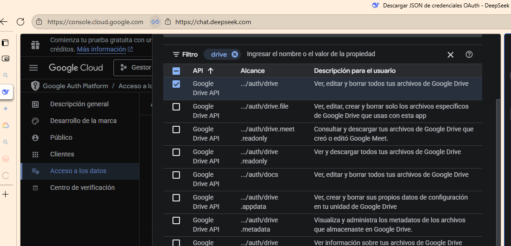

# PROYECTO PAPERLESS

### Descripción

este es un sistema de gestión de documentos diseñado para digitalizar y organizar archivos de manera eficiente. El proyecto busca proveer una plataforma centraliada para subir, clasificar y acceder a documentos academicos de forma segura.

### Arquitectura y Herramientas

### BackEnd

- **Lenguaje:** Python
- **Framwork:** Django

### FrontEnd

- **Lenguajes:** HTML5, CSS3, JavaScript
- **Plantilla:** Por definir

### Bases de Datos y Almacenamiento

- **Base de datos:**

  - **Desarrollo:** SQLite
  - **Produccion (opcional):** PostgreSQL(Elegida por su robustez y escalabilidad)

- **Almacenamiento De Archivos:** AMAZON S3 (Elegido por alamacenar archivos grandes de manera eficiente y profesional).

### CheckList Por Etapas

1️⃣ Modelado de Datos
[x] Definir tablas: usuario, documento, categoria, historial, rol.
[x] Establecer relaciones entre tablas.
[] Crear migraciones en Django y aplicar a la base de datos.

2️⃣ Configuración AWS S3
[x] Crear bucket: web-paperless-bucket.
[x] Crear usuario IAM (PaperlessS3User) y asignar permisos (GetObject, PutObject, ListBucket, DeleteObject).
[x] Configurar credenciales (Access Key / Secret Key) en Django o variables de entorno.
[] Probar conexión con boto3 (subida, listado, descarga, eliminación).

3️⃣ Backend Django
Crear vistas para:
[] Subir documentos (upload)
[] Listar documentos (list)
[] Descargar documentos (download)
[] Eliminar documentos (delete)
[] Validar permisos según roles de usuario.
[] Registrar historial de acciones (quién, qué, cuándo).
[] Manejar errores (tipo de archivo, tamaño, conexión S3).

4️⃣ Frontend
[] Crear formularios para subir archivos (<input type="file">).
[] Mostrar lista de documentos con opciones de descargar o eliminar.
[] Mensajes de confirmación o error para el usuario.
[] Integrar con las vistas Django.

5️⃣ Pruebas
[] Unitarias: verificar lógica de subida, listado, descarga y eliminación.
[] Funcionales: probar la app completa desde el frontend.
[] Validar permisos de usuario y roles.

6️⃣ Producción y Optimización
[] Configurar PostgreSQL (si no se queda SQLite).
[] Configurar almacenamiento estático y media en S3.
[] Considerar presigned URLs para descargas directas sin pasar por backend.
[] Revisar seguridad y manejo de credenciales.

### Diagrama De Flujo

          ┌────────────┐
          │  Usuario   │
          └─────┬──────┘
                │ Interacción (subir/listar/descargar/eliminar)
                ▼
       ┌─────────────────┐
       │   Frontend      │
       │  (HTML/JS)      │
       └─────┬───────────┘
             │ Llama a vistas Django
             ▼
       ┌─────────────────┐
       │   Backend Django│
       │ (Vistas/Models) │
       ├─────────────────┤
       │ Funciones boto3 │
       └─────┬───────────┘
             │ Realiza operaciones
             ▼
       ┌─────────────────┐
       │   AWS S3 Bucket │
       │ web-paperless-  │
       │      bucket     │
       └─────────────────┘

1. Usuario: Interactúa con la web (subir, listar, descargar o eliminar archivos).
2. Frontend: Formulario HTML y botones de acción que envían solicitudes al backend.
3. Backend Django:
   --Recibe solicitudes del frontend.
   --Valida permisos según rol.
   --Usa boto3 para interactuar con S3.
   --Registra historial de acciones en la base de datos.
4. AWS S3:
   Almacena los archivos de forma segura y escalable.
   Permite subir (upload), listar (list), descargar (download) y eliminar (delete) archivos.

💡Tip:
--Este flujo se puede expandir incluyendo PostgreSQL para producción y mensajes de error/mensajes de éxito que se envían desde backend al frontend.
--También puedes indicar presigned URLs en el flujo de descarga para que los archivos se puedan bajar directamente desde S3.

## Estructura típica de venv:

Include/: contiene archivos de encabezado C/C++ si estás compilando extensiones nativas.
Lib/: aquí se instalan todas las librerías de Python que usas en tu proyecto (por ejemplo, Django, requests, etc.).
Scripts/ (en Windows) o bin/ (en Linux/macOS): contiene los ejecutables, como python.exe, pip.exe, y otros scripts.
.gitignore: evita que el entorno virtual se suba a Git (buena práctica).
pyvenv.cfg: archivo de configuración que indica que esta carpeta es un entorno virtual y qué versión de Python se está usando.

### permisos
estos permisos permites hacer crud completo a los archivos de la cuenta del usuario, esos son permisos 
que sedeben pedir 

### instalacion importante para poder utilizar el ONEDRIVE
se debe descaragar con esos comando por temas de ruta, asi en cuentra el paquete instalador.
python -m pip install --upgrade google-api-python-client google-auth-httplib2 google-auth-oauthlib